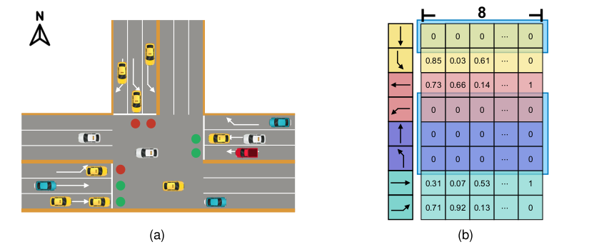
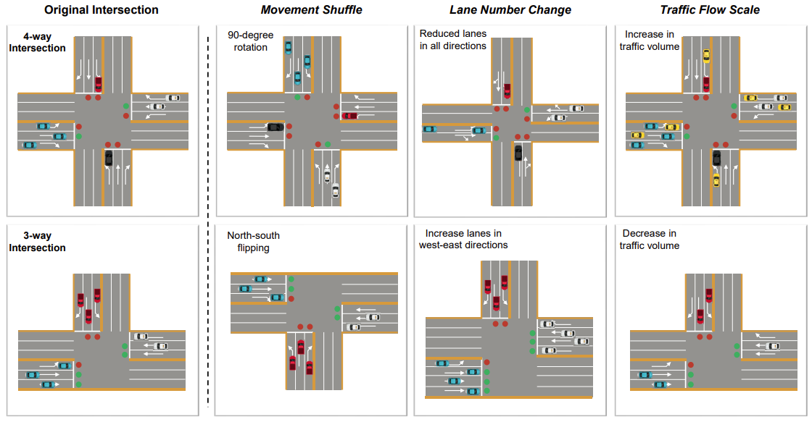
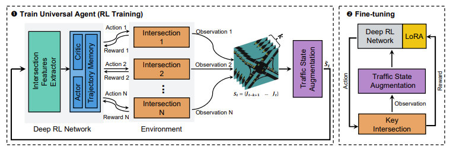
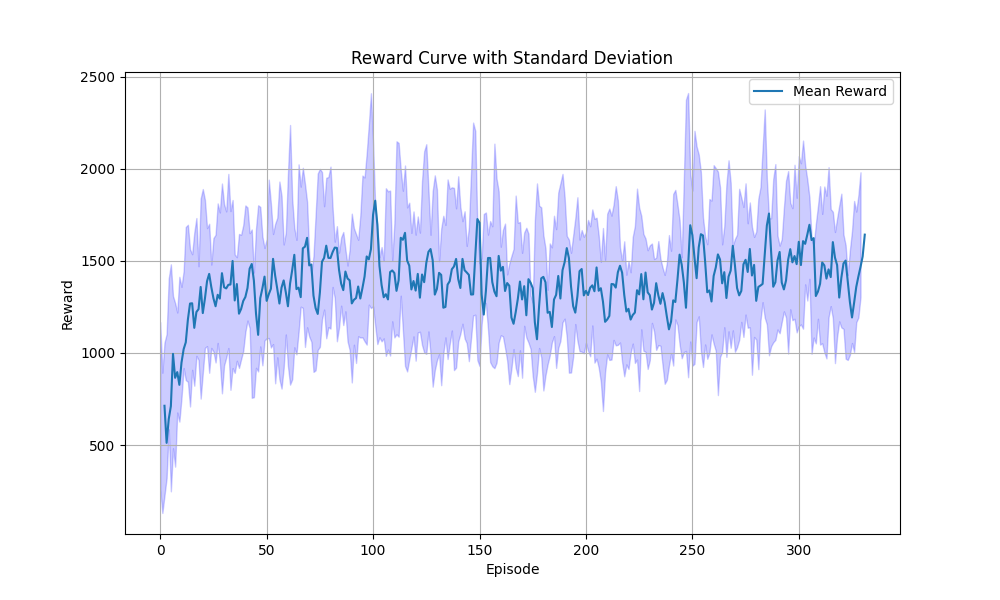

<!--
 * @Author: WANG Maonan
 * @Date: 2023-03-01 17:22:53
 * @Description: Universal Light Introduction
 * @LastEditTime: 2024-06-21 17:23:29
-->
# UniTSA: A Universal Reinforcement Learning Framework for V2X Traffic Signal Control 

**[Paper](https://ieeexplore.ieee.org/abstract/document/10535743/) | [Blog-1](https://mp.weixin.qq.com/s/RPYLqVYRyGci-r7HCsgWVw) | [Blog-2](https://github.com/Traffic-Alpha/awesome-V2X/blob/main/Paper/2024/Wang_2024_UniTSA.md) | [Model Checkpoint Download](./save_models/)**


This repository contains the code for the paper "UniTSA: A Universal Reinforcement Learning Framework for V2X Traffic Signal Control".

## 🎉 News

1. Congratulations! Our research has been accepted by IEEE Transactions on Vehicular Technology. [Read the paper here](https://ieeexplore.ieee.org/abstract/document/10535743/).
2. We have transitioned the simulation platform in the project from Aiolos to [TransSimHub](https://github.com/Traffic-Alpha/TransSimHub) (TSHub). We extend our gratitude to our colleagues at SenseTime, **@KanYuheng (阚宇衡)**, **@MaZian (马子安)**, and **@XuChengcheng (徐承成)** (listed alphabetically) for their contributions. The development of TransSimHub (TSHub) is built upon the foundation of Aiolos.
3. The weights of the model have been uploaded. The uploaded model weights can be found in [save_models](./save_models) and can be verified using `eval_model.py`.

## 🔑 Key Points

- **Universal Model for Different Intersections**: UniTSA uses a junction matrix to characterize different intersections, enabling the same model to be applied to various intersection designs.

<div align=center>
   
</div>
<p align="center">(a) A 3-way intersection with (b) its junction matrix with zero padding.</p>

- **Performance Enhancement at Unseen Intersections**: UniTSA incorporates traffic state augmentation techniques that emphasize the relative positioning of vehicles, enhancing the model's adaptability to changing traffic conditions and unfamiliar scenarios.

<div align=center>
   
</div>
<p align="center">llustration of three traffic state augmentation methods applied to both 4-way and 3-way intersections.</p>


- **Improved Results at Key Intersections**: UniTSA integrates the Low-Rank Adaptation (LoRA) method, allowing for efficient model customization to specific intersections with minimal additional training.

<div align=center>
   
</div>
<p align="center">The overall framework of UniTSA, including: 1. RL Training and 2. Fine-tuning.</p>

## 📥 Installation

Before using, make sure [TSHub](https://github.com/Traffic-Alpha/TransSimHub/tree/main) is installed.

```shell
git clone https://github.com/Traffic-Alpha/TransSimHub.git
cd TransSimHub
pip install -e ".[rl]"
```

## 🏃‍♂️ Training

After installation, run `train_UniTSA.py` to train the model.

```shell
python train_UniTSA.py
```

The trained reward curve is roughly as follows:

<div align=center>
   
</div>

Note: There are large fluctuations here because the rewards vary greatly in different environments. You can rollout in advance to get the mean and variance for normalization.

The trained model will be stored in the [save_models](./save_models) directory. This model can be applied to intersections of varying structures. **For improved results under diverse traffic flow patterns, we recommend generating a wider variety of routes for training.** Please note that currently, only a subset of `rou` files have been uploaded.

## 🧪 Testing

Testing can be done later. If you want to test directly on the road network in this article, you can run:

```shell
python eval_model.py
```

If you want to replace it with your own road network, you can put the road network in [sumo_datasets](./sumo_datasets/), and then modify [EVAL_CONFIG](./sumo_datasets/EVAL_CONFIG.py) to modify the corresponding road network. 

For example, you can modify the `EVAL_CONFIG` as follows:

```python
EVAL_SUMO_CONFIG = dict(
    # Four-way intersection, lane count (3,3,3,3)
    test_four_34=dict(
        tls_id = 'J1',
        sumocfg = 'test_four_34.sumocfg',
        nets = ['4phases.net.xml'],
        routes = ['0.rou.xml', '1.rou.xml',],
        start_time = 0,
        edges = ['E0', '-E1', '-E3'],
        connections = {
            'WE-EW':['E0 E1', '-E1 -E0'],
            'NS-SN':['-E3 E2', '-E2 E3']
        }
    ),
)
```

Here:

- `test_four_34`: Modify this to the name of your new folder.
- `sumocfg`: This is the path to the sumocfg file, which needs to be in the `env` directory.
- `nets`: This is the name of the SUMO net file. There can be multiple files.
- `routes`: This is the file name of SUMO routes, which needs to be in the `routes` directory. There can be multiple files.

## 📚 Citation

If you find this work useful, please cite our papers:

```bibtex
@article{wang2024unitsa,
  author={Wang, Maonan and Xiong, Xi and Kan, Yuheng and Xu, Chengcheng and Pun, Man-On},
  journal={IEEE Transactions on Vehicular Technology}, 
  title={{UniTSA}: A Universal Reinforcement Learning Framework for V2X Traffic Signal Control}, 
  year={2024},
  volume={},
  number={},
  pages={1-16},
  doi={10.1109/TVT.2024.3403879}
}
```

The paper below presents the preliminary concept of `UniTSA`, specifically introducing the `movement shuffle` concept:

```bibtex
@inproceedings{wang2022adlight,
  title={{ADLight}: A Universal Approach of Traffic Signal Control with Augmented Data Using Reinforcement Learning},
  author={Wang, Maonan and Xu, Yutong and Xiong, Xi and Kan, Yuheng and Xu, Chengcheng and Pun, Man-On},
  booktitle={2023 Transportation Research Board Annual Meeting (102nd TRB)},
  year={2023},
}
```


## 📫 Contact

If you have any questions, please open an issue in this repository. We will respond as soon as possible.